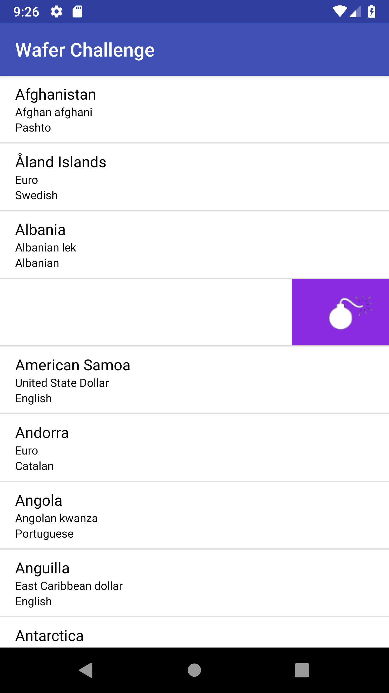

# challenge_wafer

This example consists of a listView with custom swipe feature using OnTouchListener.

list_item.xml which is the layout file for a single row of the listView is created as a FrameLayout containing a RelativeLayout in front of the parent level of the row layout.
Note that it is brought to front in listView's adapter.

OnTouchListener is registered for RelativeLayout and listens for this view's translation. Following cases are successfully done listening
MotionEvent.ACTION_MOVE and MotionEvent.ACTION_UP cases:

<ul>
  <li>It should have an anchor point for where the swipe just shows the delete icon.</li>
  <li>On a fast swipe past anchor point the row should delete.</li>
  <li>On a slow swipe past anchor point, swiped area should swipe back to anchor point showing the delete icon</li>
  <li>On a slow swipe till anchor point, the swipe should get cancelled.</li>
  <li>Clicking/Swiping any other row should cancel the current swipe</li>
</ul>  

Note that anchor point is decided as 1/4 of a single item row.

More info provided within the comments.

<h2> Some references to mention </h2>

<ul>
  <li>API: https://restcountries.eu/rest/v2/all</li>
  <li>ListView animations: https://youtu.be/8MIfSxgsHIs</li>
  <li>ListView deletion: https://youtu.be/NewCSg2JKLk</li>
  <li>Track touch and pointer movements: https://developer.android.com/training/gestures/movement</li>
</ul>
